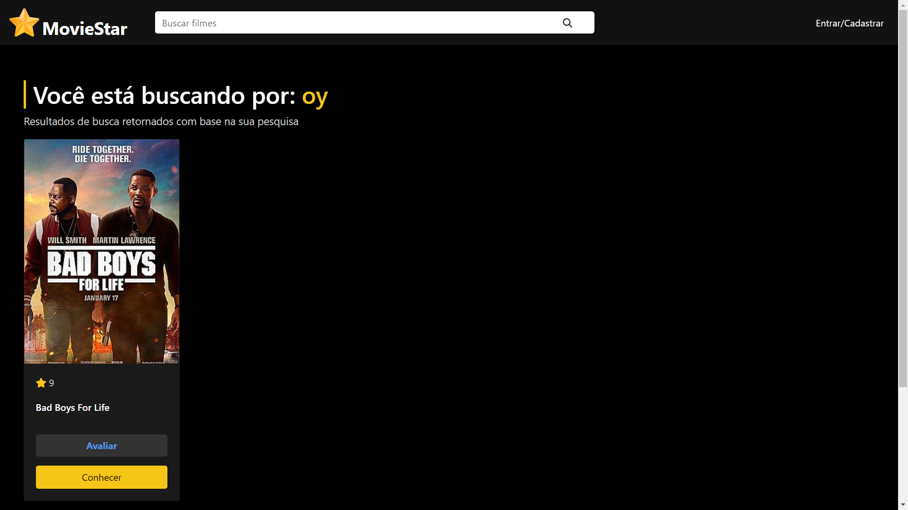

# MovieStar
> Rede social de avaliação de filmes construída em PHP para treinar meus conhecimentos iniciais na linguagem.

Este projeto consiste na criação de uma rede social de avaliação de filmes, construída em PHP. O projeto é desenvolvido como parte de um curso da Udemy sobre PHP, com o objetivo de aprimorar e aplicar os conhecimentos adquiridos durante o curso.

O MovieStar funcionará como um projeto web completo, com login de usuários, criação de contas, cadastro de filmes, sistema de avaliação, sistema de pesquisa e muito mais para tornar esse projeto o mais próximo de um projeto real.

Além disso, o projeto será uma extensão do aprendizado teórico que venho publicando em <https://github.com/katiri/PHP>, permitindo a implementação de funcionalidades reais em um ambiente controlado e focado no desenvolvimento de habilidades em PHP.

## Telas

## Observações
Para além do PHP o projeto também aborda um pouco sobre estrutura HTML, CSS, responsividade, MySQL, PDO, prepared statements e Design patterns como o DAO.

## Meta
João Pedro Pazos Ramos - <jpedropazosramos@email.com>

<https://github.com/katiri/MovieStar>